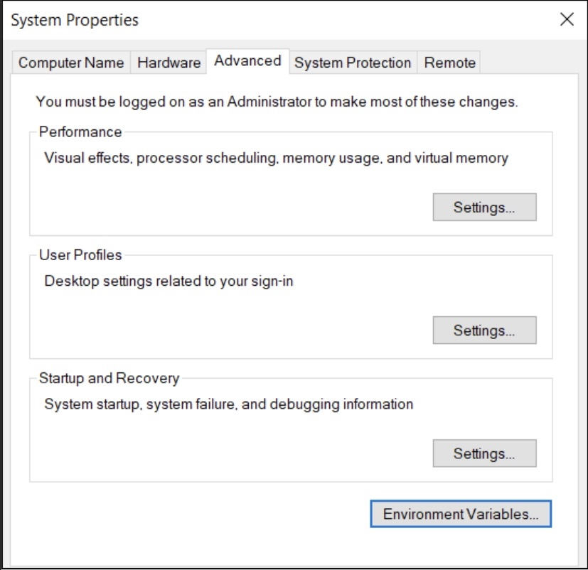
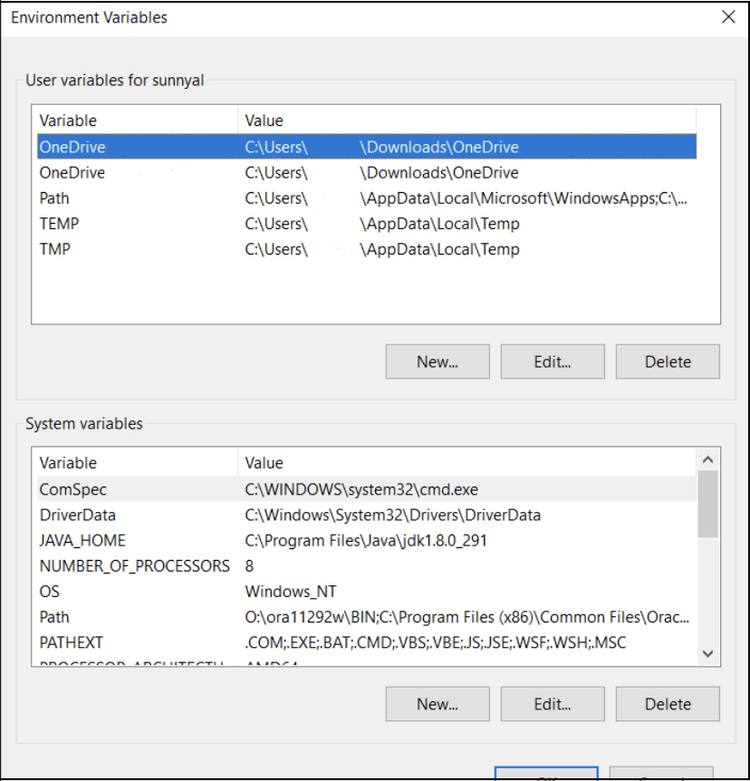

# LEARNING JAVA
> Hi, My name is Sunny Vats and this repository is to guide you for learning java so that you can build Java Applications.
> This repository will contain code snippets for the examples of topics.

### What is Java?
    1. Java is a programming language.
    2. It is an object-oriented language (i.e the objects can be mapped in real world)
    3. It is a platform independent language (i.e write once run anywhere)
    
### What you need, to learn Java?
    1. a Text editor
    2. a JDK installed on your machine
    3. a JRE &
    4. an IDE or Command Line on your machine

# **HOW TO INSTALL SETUP**?
### Installation on Windows and Mac OS

Complete the following tasks to setup Java Development Environment:

- [ ] Install JDK.
- [ ] Install JRE. (in case you're installing Java8)
- [ ] Check in command line whether installed successfully.

## INSTALLING JDK
> [JDK16 Download Link](http://oracle.com/java/technologies/javase-jdk16-downloads.html) : Click on link and find your setup according to your Operating system architecture (x86/x64/macOS), if installing JDK8. By the time of writing this repo, JDK16 is the latest version of JDK and it does not have support for x86 architecture type OS. You can download latest by using [This link](http://oracle.com/java/technologies/javase-downloads.html).

- The download page will look something like this for JDK16:

There are two options for both  Mac OS and Windows OS. Either you can use installer(i.e `.dmg` or `.exe`) or you can download compressed archive(i.e `.tar.gz` or `.zip`) file respectively.

- If you have downloaded installer, then installation can be done by clicking on downloaded installer and following installer guide. Just click next next, accept terms and conditions and enter your admin password, if prompted. On Mac OS, the setup file might get warning on opening that the file is downloaded from internet and might be insecure to open. Just ignore it and open the `.dmg` file using `control + right click` and select open. This will bypass the warning.

- If you have downloaded compressed archive, then the installation can done by completing following task:
  - [ ] unzip archive file using **Archive Utility** on Mac OS and `right-click` and select `Extract here` on Windows to extract archive files.
  - [ ] extracted folder will be named `jdk-$version.$major.$minor.jdk` where $version in our case is 16 and major, minor are 0,2. So the file that I extracted is `jdk-16.0.2.jdk`.
  - [ ] copy the extracted file to location `/Library/Java/JavaVirtualMachines` on Mac OS and `C:\Program Files\Java` on Windows OS. If Java folder is not present in Program Files folder, create one and paste the extracted folder to it.
  - [ ] On Mac OS, you don't have to set PATH as it automatically picks latest JDK on its own.
  - [ ] On Windows, click on Windows icon at bottom-left corner and type `Edit the system environment variable`. Open it, and choose `Environment Variable...` from `Advanced` tab.
  > It will look something like this:
    

  - [ ]  A new window will open with two fields marked as User and System variables. Click on `Path variable` in System variables list and click on edit.
  > It will look something like this:
    
  
  - [ ] The new window will be prompted with multiple options on right side. Click on `New` and paste the path of `bin` directory of JDK in program files.
  - [ ] The path will look like this: `C:\Program Files\Java\jdk-16.0.2.jdk\bin`. You can also create another variable with name exactly `JAVA_HOME` and then set path to `%JAVA_HOME%\bin` as you can see in above image for JDK8 installed on my machine. Just change the version number accordingly.
  - [ ] Click OK and you are done. 
  
> **NOTE:** This process of setting path is also done in case you are using installer to install **JDK** on Windows.

## INSTALLING JRE FOR JDK 8
> Follow the same process as above and set path for JRE bin as described in above section or use installer to install JRE to your system.

## VERIFY INSTALLATION
  - Use following command to check whether JDK and JRE are installed properly or not.
    ```sh
    $ javac --version   # Output: jdk-16.0.2.jdk
    $ java --version    # Output: openjdk 16.0.2 2021-07-20 
                        # OpenJDK Runtime Environment (build 16.0.2+7-67) 
                        # OpenJDK 64-Bit Server VM (build 16.0.2+7-67, mixed mode, sharing)
    ```
  - Your output may differ in case you have installed different JDK. But the format will be same. This output means that your JDK and JRE is configured properly.